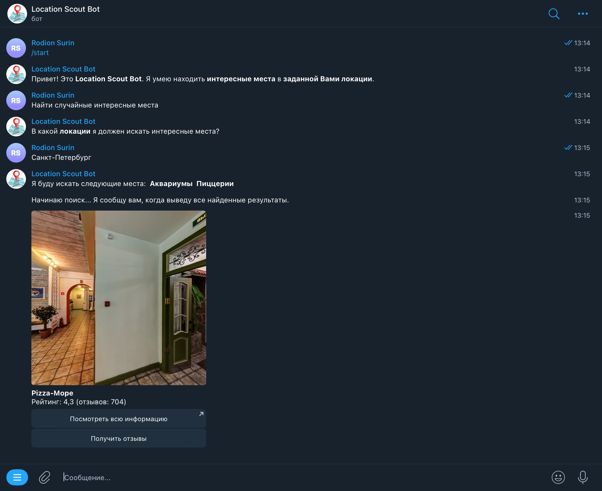

# Telegram-бот "Location Scout Bot"

Location Scout Bot позволяет пользователям находить интересующие их или случайные интересные места в заданной локации. Для каждого найденного места бот отправляет его название, фотографию, рейтинг, количество отзывов, две кнопки: одна с ссылкой на место, другая позволяет получить сами отзывы о месте.

Чтобы получить такого же работающего бота, вставьте в `bot.py` вместо `'your-OpenAI-API-key'` и `'your-bot-API-key'` свои API-ключи от OpenAI и своего Telegram-бота соответственно, затем, находясь в директории со склонированным содержимым, пропишите
```
./run.sh
```

